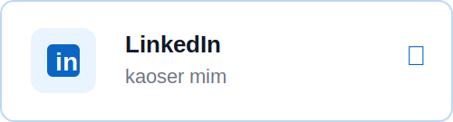
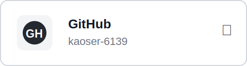

# Hi, I'm Md. Imrul Kaoser 👋

### ASP.NET Core Intern | Junior .NET Developer | C# | SQL Server

I am a backend-focused .NET developer from Bangladesh, focused on building web applications using **ASP.NET Core MVC**, **Entity Framework Core**, and **SQL Server**.

Currently, I am improving my skills through real-world projects, clean architecture practices, database design, and backend-focused web application development.

---

## Quick Navigation

  
  
  
  
  

---

## About Me

- 🔭 Currently working with **ASP.NET Core MVC**, **Entity Framework Core**, and **SQL Server**
- 🌱 Learning backend development, clean architecture, authentication, authorization, and scalable web application design
- 💻 Interested in **C#**, **ASP.NET Core**, **SQL Server**, database-driven applications, and backend systems
- 🧠 Familiar with **Clean Architecture**, **Repository Pattern**, **Unit of Work**, **CQRS/MediatR**, **SOLID**, and **OOP**
- 🎯 Looking for **ASP.NET Core internship** or **junior .NET developer** opportunities
- 📍 Based in Dhaka, Bangladesh

  

---

## Skills & Technologies

<table>
  <tr>
    <td width="230"><strong>Primary Skills</strong></td>
    <td>
      <code>C#</code>
      <code>ASP.NET Core MVC</code>
      <code>Entity Framework Core</code>
      <code>SQL Server</code>
    </td>
  </tr>
  <tr>
    <td><strong>Backend & Architecture</strong></td>
    <td>
      <code>Clean Architecture</code>
      <code>Repository Pattern</code>
      <code>Unit of Work</code>
      <code>SOLID</code>
      <code>OOP</code>
      <code>CQRS / MediatR</code>
    </td>
  </tr>
  <tr>
    <td><strong>Database</strong></td>
    <td>
      <code>SQL Server</code>
      <code>Stored Procedures</code>
      <code>Views</code>
      <code>LINQ</code>
    </td>
  </tr>
  <tr>
    <td><strong>Security & Authentication</strong></td>
    <td>
      <code>Authentication</code>
      <code>Authorization</code>
      <code>RBAC</code>
      <code>Claims Based Authorization</code>
      <code>Policy Based Authorization</code>
    </td>
  </tr>
  <tr>
    <td><strong>Frontend Basics</strong></td>
    <td>
      <code>HTML</code>
      <code>CSS</code>
      <code>Bootstrap</code>
      <code>JavaScript</code>
    </td>
  </tr>
  <tr>
    <td><strong>Tools & Version Control</strong></td>
    <td>
      <code>Git</code>
      <code>GitHub</code>
      <code>Docker</code>
      <code>Visual Studio</code>
      <code>VS Code</code>
    </td>
  </tr>
  <tr>
    <td><strong>Familiar With</strong></td>
    <td>
      <code>AWS EC2</code>
      <code>AWS S3</code>
      <code>AWS IAM</code>
      <code>Unit Testing</code>
      <code>Manual Testing</code>
    </td>
  </tr>
</table>

  <em>Always learning. Always building.</em>

  

---

---

## Featured Projects

<table>
  <tr>
    <td width="50%" valign="top">

### Gym Management System with Smart Fitness Coach

**Main Project**

A web-based gym management system built with **ASP.NET Core MVC**, **.NET 9**, and **SQL Server**, featuring role-based administration and an AI-powered fitness coach using **OpenRouter API**.

**Features:** Admin dashboard, member management, trainer assignment, membership tracking, equipment management, pending payment approval, member profile, AI fitness coach.

**Tech Stack:**  
<code>C#</code>
<code>ASP.NET Core MVC</code>
<code>.NET 9</code>
<code>EF Core</code>
<code>SQL Server</code>
<code>Bootstrap</code>
<code>JavaScript</code>
<code>OpenRouter API</code>

**Repository:** [GYM.Mi.Web](https://github.com/Kaoser-6139/GYM.Mi.Web)

  </td>
  <td width="50%" valign="top">

### Inventory Management System

**Course-Based Project**

A course-based ASP.NET Core MVC inventory management project focused on managing products, customers, warehouses, and inventory operations.

**Features:** Product management, customer management, warehouse inventory operations, claim-based authorization, Docker-based development support.

**Tech Stack:**  
<code>C#</code>
<code>ASP.NET Core MVC</code>
<code>EF Core</code>
<code>SQL Server</code>
<code>Docker</code>

**Repository:** [DevSkill.Inventory.Web](https://github.com/Kaoser-6139/DevSkill.Inventory.Web)

  </td>
  </tr>
</table>

  

---

---

## GitHub Analytics

  <em>A quick snapshot of my GitHub activity and language usage.</em>

  

  

  

---

## Connect with Me

  Let's connect! Feel free to reach out through any of the platforms below.

---

  
  &nbsp;&nbsp;
  
  &nbsp;&nbsp;
  

 
 

  

